<!-- MDTOC maxdepth:6 firsth1:1 numbering:0 flatten:0 bullets:1 updateOnSave:1 -->

- [Dockerfile详解](#dockerfile详解)   
   - [自制docker镜像途径](#自制docker镜像途径)   
   - [关于dockerfile](#关于dockerfile)   
   - [dockefile语法格式](#dockefile语法格式)   
   - [.dockerignore文件](#dockerignore文件)   
   - [环境变量](#环境变量)   
   - [dockerfile指令](#dockerfile指令)   
      - [FROM指令](#from指令)   
      - [MAINTANIER指令(已经废弃)](#maintanier指令已经废弃)   
      - [LABEL指令](#label指令)   
      - [COPY指令](#copy指令)   
      - [ADD指令](#add指令)   
      - [WORKDIR指令](#workdir指令)   
      - [VOLUME指令](#volume指令)   
      - [EXPOSE指令](#expose指令)   
      - [ENV指令](#env指令)   
      - [RUN指令](#run指令)   
      - [CMD命令](#cmd命令)   
      - [ENTRYPOINT指令](#entrypoint指令)   
      - [ENTRYPOINT 入口点](#entrypoint-入口点)   
   - [docker build制作镜像](#docker-build制作镜像)   

<!-- /MDTOC -->
# Dockerfile详解


## 自制docker镜像途径

* 基于容器
  - 二次打包
* 基于dockerfile
  - 从无到有构造


## 关于dockerfile

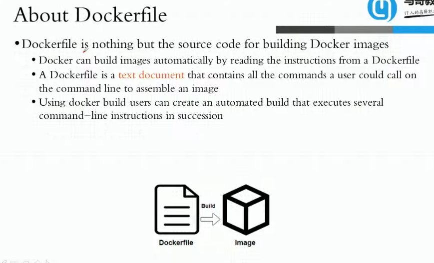


## dockefile语法格式

* dockerfile = N * [ 注释+指令及其参数 ]
* 指令本身不区分大小写，约定俗成管理，**使用大写**
* 第一条指令必须是**FROM**指令，指定镜像，基于镜像二次构造

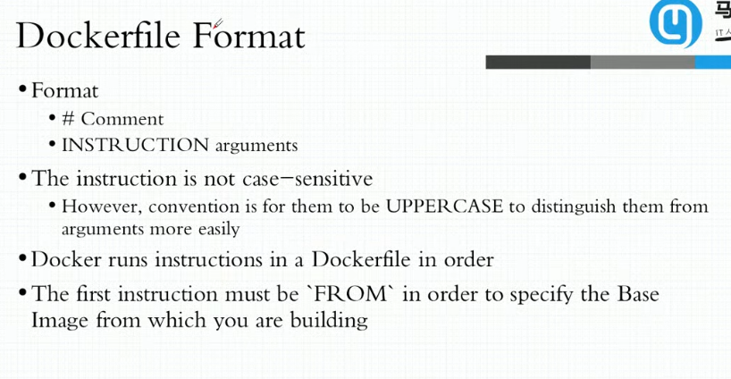


## .dockerignore文件

* 文本文件，类似.gitignore，文件排除列表，文件排除名单
* 所有在打包时的文件中，但凡写在.dockerignore文件中的文件不包含，包括.dockerignore本身
* .

## 环境变量

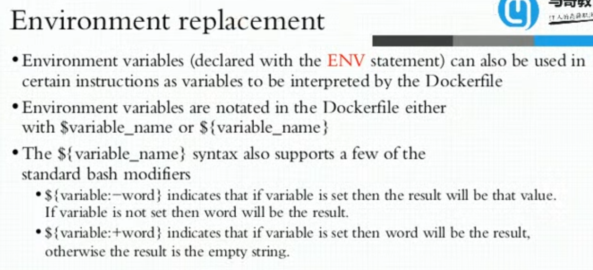

* 相似于shell环境变量，隐含if-else语句
  - ${variable:-word} : variable没有定义或者为空，则为word
  - ${variable:-word} : variable没有定义或者为空，则为word


## dockerfile指令


* Dockerfile创建，D要大写
* **务必惜字如金，每一条指令多一层**

### FROM指令

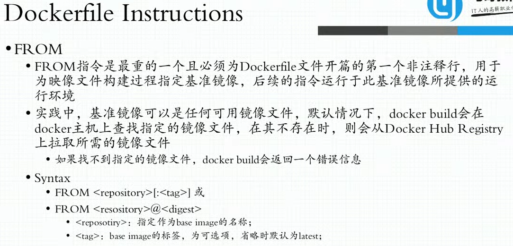

* 基于镜像二次构建，FROM指明基于哪个镜像
* 可以通过哈希值指定镜像

```
FROM <repository>[:<tag>]
或
FROM <repository>@<digest>
```

* tag默认为latest
* digest是镜像哈希值

实例：

```
FROM busybox:latest

或

FROM buxybox@哈希值  （建议写法，安全性更高）
```

### MAINTANIER指令(已经废弃)


```
MAINTAINER <author's detail>
```

* 已经废弃
* 提供维护者、创始人信息，一般是名称+邮件（联系方式）


实例：

```
MAINTAINER "mageedu <mage@mageedu.com>"
```


### LABEL指令

* docker 17版之后方可使用
* 可以将Maintainer信息作为label嵌入

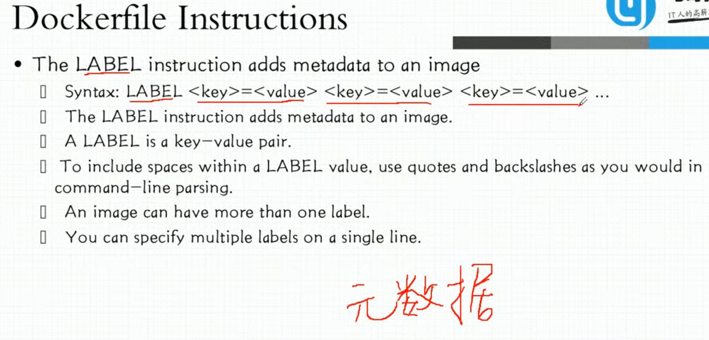


### COPY指令


* 宿主机中的文件，打包，放到目标镜像中
* 从当前工作目录中的某个、某些文件复制到目标镜像中

```
COPY <src> ... <dest>
或
COPY [“<src>” ... “<dest>”]
```

* 类似于mv、cp命令
* src 指明需要复制的文件或目录，支持通配符，**建议相对路径**，dockerfile工作目录
* dest 目标路径，正在创建的image文件系统路径，目标镜像中存放该文件/目录的路径，**建议dest使用绝对路径**
* **文件名中有空白字符，必须用引号引用，不然会被拆分**

文件复制准则

* <src>必须是build上下文路径，不能使用父目录文件
* <src>必须存在，不存在无中生有的拷贝
* **<src>是目录，则递归复制，但是<src>目录自身不会被复制**
* 如果指定了多个<src>或者<src>使用通配符，则<dest>必须是目录，目录才能存下多目标
* <dest>事先不存在则会自动创建，包括父目录，相当于```mkdir -p```


实例：

```
COPY index.html /data/web/html/
```

build文件夹结构

```
PWD:
| - Dockerfile
| - index.html
```

### ADD指令

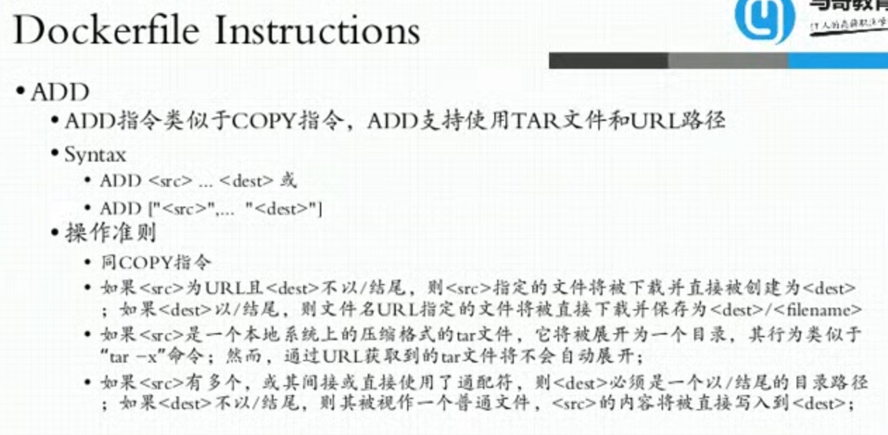

* ADD类似COPY指令，但是支持TAR文件和URL路径，相当于增强的COPY
* 如果<src>是TAR文件，可以自动解压到目录，但是**如果是URL中的tar文件，则不会被展开**

```
ADD <src> ... <dest>
或
ADD [“<src>” ... “<dest>”]
```

实例：


### WORKDIR指令

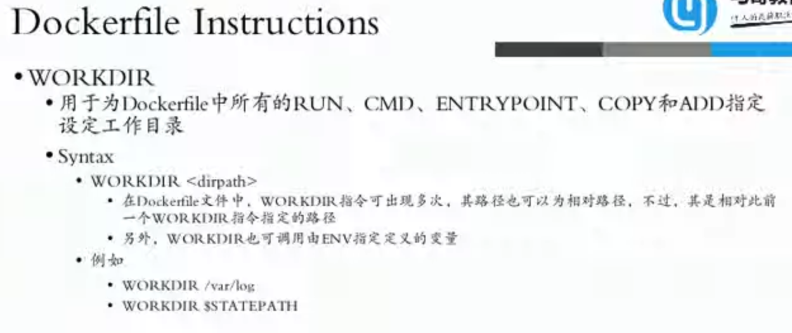

```
WORKDIR <dirpath>
```

* 每次执行路径就切换，影响从当前指令开始
* 建议为绝对路径，也可以将环境变量值作为路径

实例：


### VOLUME指令


```
VOLUME <mountpoint>
或
VOLUME [“<mountpoint>”]
```

* 只要镜像中定义了VOLUME，容器运行时候，自动挂载

实例：

```
FROM busybox:latest
MAINTAINER “MageEdu <mage@mageedu.com>”
# LAGEL maintainer="MageEdu <mage@mageedu.com>"
COPY index.html /data/web/html/
COPY yum.repos.d /etc/yum.repos.d/
WORKDIR /usr/local/

ADD nginx-1.15.2.tar.gz ./src/

VOLUME /data/mysql/

```

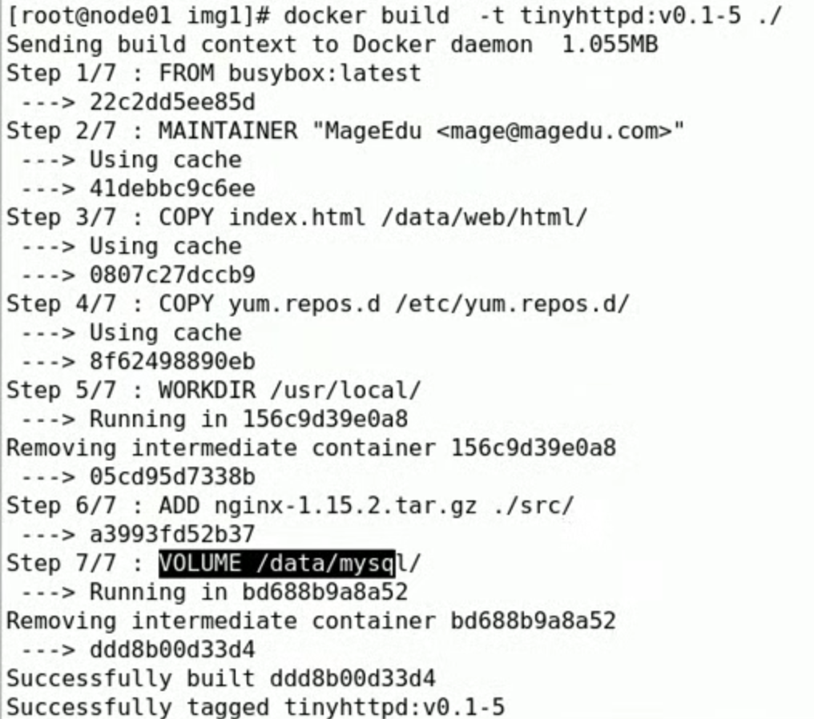


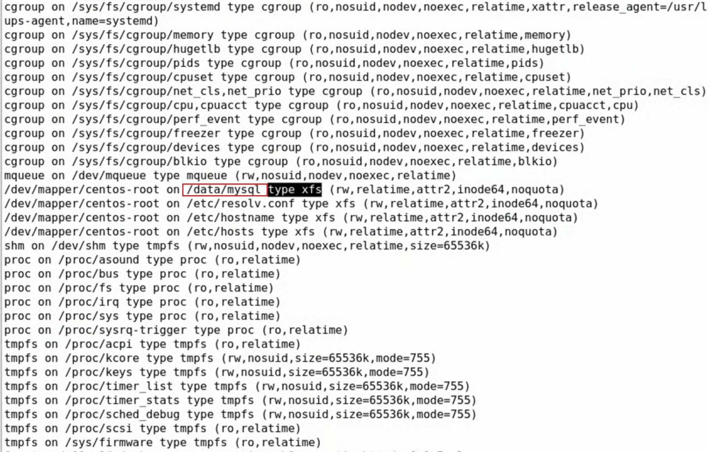

### EXPOSE指令

* 把容器中服务监听端口开发给宿主机端口，自动生成DNET规则
* 一次可以指定多个端口
* 默认协议就是tcp

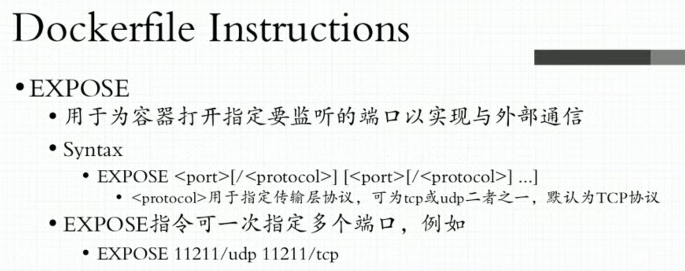

```
EXPOSE <port>[/<protocal>][<port>[/<protocal>]...]
```

实例：

```
FROM busybox:latest
MAINTAINER “MageEdu <mage@mageedu.com>”
# LAGEL maintainer="MageEdu <mage@mageedu.com>"
COPY index.html /data/web/html/
COPY yum.repos.d /etc/yum.repos.d/
WORKDIR /usr/local/

ADD nginx-1.15.2.tar.gz ./src/

VOLUME /data/mysql/

EXPOSE 80/tcp
```

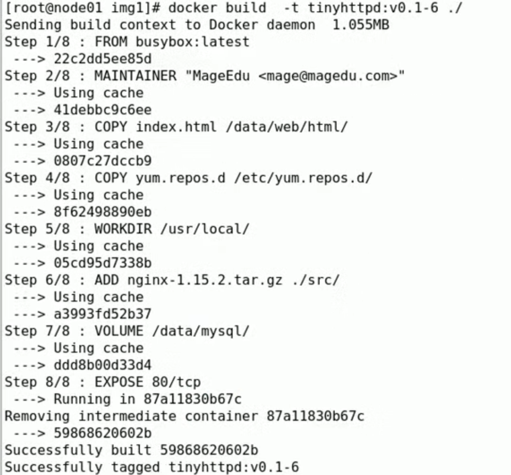


```
docker inspect tinyhttpd:v0.1-6
```

* 查看ip地址


* 未必真的暴露端口


* 镜像中端口与外部端口，为什么外部端口是随机？不能指定？可以-p INPORT:OUTPUT 指定，但是镜像内部不得行
* 运行容器是加-P指定才能暴露端口

### ENV指令

* 为镜像定义环境变量，影响其后的其他指令

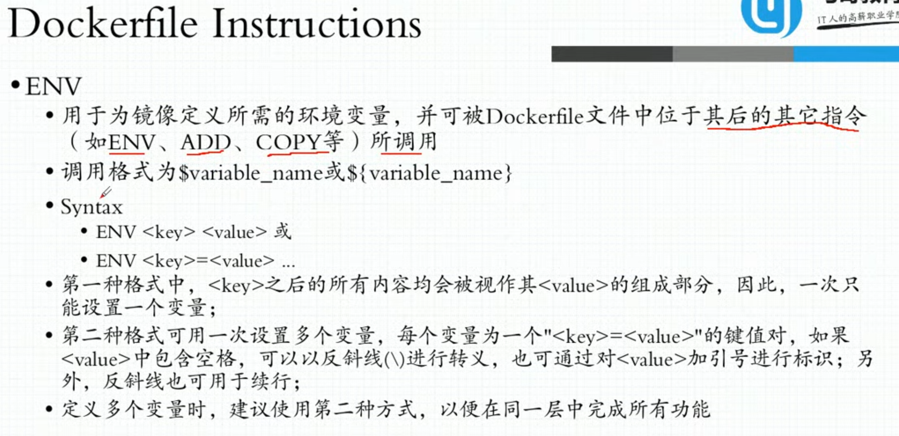

```
ENV <key> <value>
或
ENV <key>=<value> ...

只有第二种可以定义多个，第一种只能定义一个
```

* **尽量定义到一个指令中，因为每个指令都要生成一个新层**
* 定义多个变量，使用第二种

实例：

```
FROM busybox:latest
MAINTAINER “MageEdu <mage@mageedu.com>”
# LAGEL maintainer="MageEdu <mage@mageedu.com>"

ENV DOC_ROOT /data/web/html/

COPY index.html ${DOC_ROOT:-/data/web/html}  # 万一 DOC_ROOT 没有值呢？定义默认呗

COPY yum.repos.d /etc/yum.repos.d/
WORKDIR /usr/local/

ADD nginx-1.15.2.tar.gz ./src/

VOLUME /data/mysql/

EXPOSE 80/tcp
```


实例：

```
FROM busybox:latest
MAINTAINER “MageEdu <mage@mageedu.com>”
# LAGEL maintainer="MageEdu <mage@mageedu.com>"

ENV DOC_ROOT=/data/web/html/ \
    WEB_SERVER_PACKAGE="nginx-1.15.2.tar.gz"

COPY index.html ${DOC_ROOT:-/data/web/html}  # 万一 DOC_ROOT 没有值呢？定义默认呗

COPY yum.repos.d /etc/yum.repos.d/
WORKDIR /usr/local/

ADD ${WEB_SERVER_PACKAGE} ./src/

VOLUME /data/mysql/

EXPOSE 80/tcp
```


* 使用docker run也可以传递环境变量值
* docker build也可以传递环境变量值

```
  -e, --env list                   Set environment variables
  --env-file list                  Read in a file of environment variables
```


* 在Dockerfile中定义的变量会注入到容器中，启用即生效


可以分阶段插入环境变量

### RUN指令

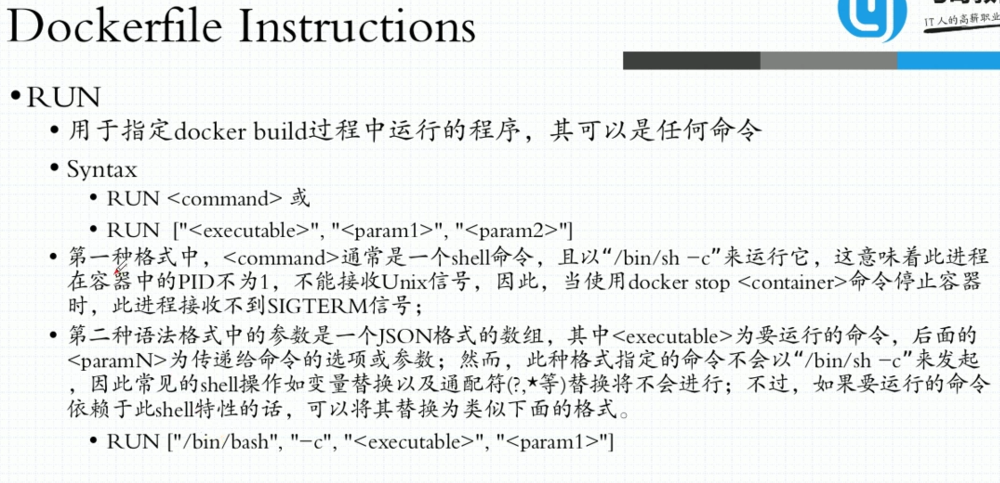

* 第一种默认启动shell子进程，第二种相当于由内核直接发起，有许多限制，但是PID=1

* 在Dockefile构建过程中运行命令
* 命令执行分阶段，一个是镜像构建过程中RUN，一个是容器运行时CMD

实例：

网络获取TAR包后手动展开。前提：目标镜像有tar命令

```
FROM busybox:latest
MAINTAINER “MageEdu <mage@mageedu.com>”
# LAGEL maintainer="MageEdu <mage@mageedu.com>"

ENV DOC_ROOT=/data/web/html/ \
    WEB_SERVER_PACKAGE="nginx-1.15.2.tar.gz"

COPY index.html ${DOC_ROOT:-/data/web/html}  # 万一 DOC_ROOT 没有值呢？定义默认呗

COPY yum.repos.d /etc/yum.repos.d/
WORKDIR /usr/local/

#ADD ${WEB_SERVER_PACKAGE} ./src/


VOLUME /data/mysql/

EXPOSE 80/tcp

ADD http://nginx.org/download/${WEB_SERVER_PACKAGE} /usr/local/src/
RUN cd /usr/local/src && tar -xf ${WEB_SERVER_PACKAGE} && mv nginx-* webserver

```

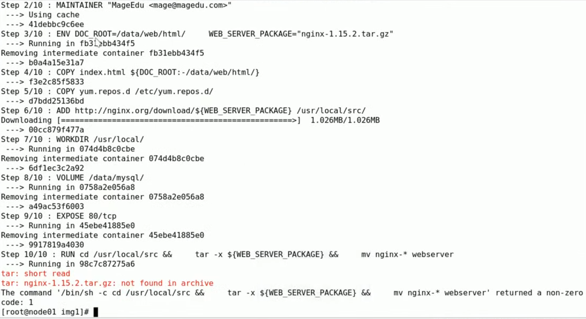

* 马哥这里运行错误是因为```tar -x```，应该写成```tar -xf```
* 使用"&&"，执行错误则后序不会执行

```
-f, --file=ARCHIVE
    Use  archive  file or device ARCHIVE.  If this option is not given, tar will first examine the environment variable `TAPE'.  If it is set, its value will be used as the archive name.  Otherwise, tar will assume
    the compiled-in default.  The default value can be inspected either using the --show-defaults option, or at the end of the tar --help output.

    An archive name that has a colon in it specifies a file or device on a remote machine.  The part before the colon is taken as the machine name or IP address, and the part after it as the file  or  device  path‐
    name, e.g.:

    --file=remotehost:/dev/sr0

    An optional username can be prefixed to the hostname, placing a @ sign between them.

    By default, the remote host is accessed via the rsh(1) command.  Nowadays it is common to use ssh(1) instead.  You can do so by giving the following command line option:

    --rsh-command=/usr/bin/ssh

    The remote machine should have the rmt(8) command installed.  If its pathname does not match tar's default, you can inform tar about the correct pathname using the --rmt-command option.
```

举例:

```
FROM centos
RUN yum install -y epel-release && yum makecache && yum install -y nginx && yum clean all
```

### CMD命令


* **允许存在多个CMD命令，但是仅最后一个持久化且有效**
* **某一进程往往是init进程的子进程，如果init进程不存在，直接就是httpd进程，会怎样？直接退出**
* Linux下进程生命周期 = 白发人送黑发人
* **如果不是作为shell的子进程启动程序，管道，重定向，通配符等都不可用！**

```
CMD <command>
或
CMD ["<command>","<param1>","<param2>"]
或
CMD ["<param1>","<param2>"]
```

举例:

```
FROM busybox:latest
LABEL maintainer="MageEdu <mage@mageedu.com>" app="httpd"

ENV WEB_DOC_ROOT="/data/web/html/"

RUN mkdir -p ${WEB_DOC_ROOT} && \
    echo '<h1>Busybox httpd server.</h1>' > ${WEB_DOC_ROOT}/index.html

CMD /bin/httpd -f -h ${WEB_DOC_ROOT}
```

* RUN的第一种写法，自动运行为shell子进程，支持输入输出重定向
* CMD的第一种写法，自动运行为shell子进程，支持输入输出重定向

```
root@vm:~# docker image inspect tinyhttpd:v0.2-1
[
    {
        "Id": "sha256:26b2b30c9c593080d98a4c80e2c9cf56e8e828fb55f4b39f677da06ed4e0ffa1",
        "RepoTags": [
            "tinyhttpd:v0.2-1"
        ],
        "RepoDigests": [],
        "Parent": "sha256:09acca9625638c05e2b757d4ea9966a71eb495eacc4388581a7cde8c7f3ddb91",
        "Comment": "",
        "Created": "2019-12-13T14:52:50.896705064Z",
        "Container": "f01c806374a540589f0f29b0facf3201021c0bdc2e1adf51f91ae720f06eb908",
        "ContainerConfig": {
            "Hostname": "f01c806374a5",
            "Domainname": "",
            "User": "",
            "AttachStdin": false,
            "AttachStdout": false,
            "AttachStderr": false,
            "Tty": false,
            "OpenStdin": false,
            "StdinOnce": false,
            "Env": [
                "PATH=/usr/local/sbin:/usr/local/bin:/usr/sbin:/usr/bin:/sbin:/bin",
                "WEB_DOC_ROOT=/data/web/html/"
            ],
            "Cmd": [
                "/bin/sh",
                "-c",
                "#(nop) ",
                "CMD [\"/bin/sh\" \"-c\" \"/bin/httpd -f -h ${WEB_DOC_ROOT}\"]"
            ],
            "Image": "sha256:09acca9625638c05e2b757d4ea9966a71eb495eacc4388581a7cde8c7f3ddb91",
            "Volumes": null,
            "WorkingDir": "",
            "Entrypoint": null,
            "OnBuild": null,
            "Labels": {
                "app": "httpd",
                "maintainer": "MageEdu <mage@mageedu.com>"
            }
        },
        "DockerVersion": "19.03.5",
        "Author": "",
        "Config": {
            "Hostname": "",
            "Domainname": "",
            "User": "",
            "AttachStdin": false,
            "AttachStdout": false,
            "AttachStderr": false,
            "Tty": false,
            "OpenStdin": false,
            "StdinOnce": false,
            "Env": [
                "PATH=/usr/local/sbin:/usr/local/bin:/usr/sbin:/usr/bin:/sbin:/bin",
                "WEB_DOC_ROOT=/data/web/html/"
            ],
            "Cmd": [
                "/bin/sh",
                "-c",
                "/bin/httpd -f -h ${WEB_DOC_ROOT}"
            ],
            "Image": "sha256:09acca9625638c05e2b757d4ea9966a71eb495eacc4388581a7cde8c7f3ddb91",
            "Volumes": null,
            "WorkingDir": "",
            "Entrypoint": null,
            "OnBuild": null,
            "Labels": {
                "app": "httpd",
                "maintainer": "MageEdu <mage@mageedu.com>"
            }
        },
        "Architecture": "amd64",
        "Os": "linux",
        "Size": 1219813,
        "VirtualSize": 1219813,
        "GraphDriver": {
            "Data": {
                "LowerDir": "/var/lib/docker/overlay2/c586926a94a04b3f5ab3f1a2d3493a7c432201f51288148e099c9a0be89119b7/diff",
                "MergedDir": "/var/lib/docker/overlay2/5852394659e7b31a257fb8878aa9d31d2b9dfc4d0b8a7eae88df60daa10973c3/merged",
                "UpperDir": "/var/lib/docker/overlay2/5852394659e7b31a257fb8878aa9d31d2b9dfc4d0b8a7eae88df60daa10973c3/diff",
                "WorkDir": "/var/lib/docker/overlay2/5852394659e7b31a257fb8878aa9d31d2b9dfc4d0b8a7eae88df60daa10973c3/work"
            },
            "Name": "overlay2"
        },
        "RootFS": {
            "Type": "layers",
            "Layers": [
                "sha256:eac247cb7af5edc34d3620e8bce653d4af7d4e3a0427d487a97530c7fac0b841",
                "sha256:8476e7faad1a524ded5f2b93495a10f1d5fb2aef326fccbf1d08e64dfbfb8e61"
            ]
        },
        "Metadata": {
            "LastTagTime": "2019-12-13T22:52:50.907503701+08:00"
        }
    }
]

```


* 显然是shell的子进程


举例:

```
FROM busybox:latest
LABEL maintainer="MageEdu <mage@mageedu.com>" app="httpd"

ENV WEB_DOC_ROOT="/data/web/html/"

RUN mkdir -p ${WEB_DOC_ROOT} && \
    echo '<h1>Busybox httpd server.</h1>' > ${WEB_DOC_ROOT}/index.html

CMD ["/bin/httpd", "-f","-h ${WEB_DOC_ROOT}"]
```

```
root@vm:/data/lab2# docker image ls -a
REPOSITORY          TAG                 IMAGE ID            CREATED             SIZE
tinyhttpd           v0.2-2              90709763d2bd        5 seconds ago       1.22MB
tinyhttpd           v0.2-1              26b2b30c9c59        10 minutes ago      1.22MB
root@vm:/data/lab2# docker image inspect tinyhttpd:v0.2-2
[
    {
        "Id": "sha256:90709763d2bde5c1c33e392c81c7ec630edaf9735852ee704e7ba17f6970f510",
        "RepoTags": [
            "tinyhttpd:v0.2-2"
        ],
        "RepoDigests": [],
        "Parent": "sha256:09acca9625638c05e2b757d4ea9966a71eb495eacc4388581a7cde8c7f3ddb91",
        "Comment": "",
        "Created": "2019-12-13T15:03:12.856805855Z",
        "Container": "c39702f5e33b49d33da591260691d7902f8c41a828fd4152f5c95980d6b4942c",
        "ContainerConfig": {
            "Hostname": "c39702f5e33b",
            "Domainname": "",
            "User": "",
            "AttachStdin": false,
            "AttachStdout": false,
            "AttachStderr": false,
            "Tty": false,
            "OpenStdin": false,
            "StdinOnce": false,
            "Env": [
                "PATH=/usr/local/sbin:/usr/local/bin:/usr/sbin:/usr/bin:/sbin:/bin",
                "WEB_DOC_ROOT=/data/web/html/"
            ],
            "Cmd": [
                "/bin/sh",
                "-c",
                "#(nop) ",
                "CMD [\"/bin/httpd\" \"-f\" \"-h ${WEB_DOC_ROOT}\"]"
            ],
            "Image": "sha256:09acca9625638c05e2b757d4ea9966a71eb495eacc4388581a7cde8c7f3ddb91",
            "Volumes": null,
            "WorkingDir": "",
            "Entrypoint": null,
            "OnBuild": null,
            "Labels": {
                "app": "httpd",
                "maintainer": "MageEdu <mage@mageedu.com>"
            }
        },
        "DockerVersion": "19.03.5",
        "Author": "",
        "Config": {
            "Hostname": "",
            "Domainname": "",
            "User": "",
            "AttachStdin": false,
            "AttachStdout": false,
            "AttachStderr": false,
            "Tty": false,
            "OpenStdin": false,
            "StdinOnce": false,
            "Env": [
                "PATH=/usr/local/sbin:/usr/local/bin:/usr/sbin:/usr/bin:/sbin:/bin",
                "WEB_DOC_ROOT=/data/web/html/"
            ],
            "Cmd": [
                "/bin/httpd",
                "-f",
                "-h ${WEB_DOC_ROOT}"
            ],
            "Image": "sha256:09acca9625638c05e2b757d4ea9966a71eb495eacc4388581a7cde8c7f3ddb91",
            "Volumes": null,
            "WorkingDir": "",
            "Entrypoint": null,
            "OnBuild": null,
            "Labels": {
                "app": "httpd",
                "maintainer": "MageEdu <mage@mageedu.com>"
            }
        },
        "Architecture": "amd64",
        "Os": "linux",
        "Size": 1219813,
        "VirtualSize": 1219813,
        "GraphDriver": {
            "Data": {
                "LowerDir": "/var/lib/docker/overlay2/c586926a94a04b3f5ab3f1a2d3493a7c432201f51288148e099c9a0be89119b7/diff",
                "MergedDir": "/var/lib/docker/overlay2/5852394659e7b31a257fb8878aa9d31d2b9dfc4d0b8a7eae88df60daa10973c3/merged",
                "UpperDir": "/var/lib/docker/overlay2/5852394659e7b31a257fb8878aa9d31d2b9dfc4d0b8a7eae88df60daa10973c3/diff",
                "WorkDir": "/var/lib/docker/overlay2/5852394659e7b31a257fb8878aa9d31d2b9dfc4d0b8a7eae88df60daa10973c3/work"
            },
            "Name": "overlay2"
        },
        "RootFS": {
            "Type": "layers",
            "Layers": [
                "sha256:eac247cb7af5edc34d3620e8bce653d4af7d4e3a0427d487a97530c7fac0b841",
                "sha256:8476e7faad1a524ded5f2b93495a10f1d5fb2aef326fccbf1d08e64dfbfb8e61"
            ]
        },
        "Metadata": {
            "LastTagTime": "2019-12-13T23:03:12.867519725+08:00"
        }
    }
]

```

运行报错


第二种格式并不会运行为shell子进程，非子进程就不会解析shell变量。
修复方法:手动将httpd置为子进程

```
FROM busybox:latest
LABEL maintainer="MageEdu <mage@mageedu.com>" app="httpd"

ENV WEB_DOC_ROOT="/data/web/html/"

RUN mkdir -p ${WEB_DOC_ROOT} && \
    echo '<h1>Busybox httpd server.</h1>' > ${WEB_DOC_ROOT}/index.html

CMD ["/bin/sh","-c","/bin/httpd", "-f","-h ${WEB_DOC_ROOT}"]
```

`CMD` 指令的格式和 `RUN` 相似，也是两种格式：

* `shell` 格式：`CMD <命令>`
* `exec` 格式：`CMD ["可执行文件", "参数1", "参数2"...]`
* 参数列表格式：`CMD ["参数1", "参数2"...]`。在指定了 `ENTRYPOINT` 指令后，用 `CMD` 指定具体的参数。

* **Docker 不是虚拟机，容器就是进程。既然是进程，那么在启动容器的时候，需要指定所运行的程序及参数。`CMD` 指令就是用于指定默认的容器主进程的启动命令的。**
* 在运行时可以指定新的命令来替代镜像设置中的这个默认命令，比如，`ubuntu` 镜像默认的 `CMD` 是 `/bin/bash`，如果我们直接 `docker run -it ubuntu` 的话，会直接进入 `bash`。我们也可以在运行时指定运行别的命令，如 `docker run -it ubuntu cat /etc/os-release`。这就是用 `cat /etc/os-release` 命令替换了默认的 `/bin/bash` 命令了，输出了系统版本信息。

在指令格式上，一般推荐使用 `exec` 格式，这类格式在解析时会被解析为 JSON 数组，因此一定要使用双引号 `"`，而不要使用单引号。

如果使用 `shell` 格式的话，实际的命令会被包装为 `sh -c` 的参数的形式进行执行。比如：

```docker
CMD echo $HOME
```

在实际执行中，会将其变更为：

```docker
CMD [ "sh", "-c", "echo $HOME" ]
```

这就是为什么我们可以使用环境变量的原因，因为这些环境变量会被 shell 进行解析处理。

提到 `CMD` 就不得不提容器中应用在前台执行和后台执行的问题。这是初学者常出现的一个混淆。

Docker 不是虚拟机，容器中的应用都应该以前台执行，而不是像虚拟机、物理机里面那样，用 `systemd` 去启动后台服务，容器内没有后台服务的概念。

一些初学者将 `CMD` 写为：

```docker
CMD service nginx start
```

然后发现容器执行后就立即退出了。甚至在容器内去使用 `systemctl` 命令结果却发现根本执行不了。这就是因为没有搞明白前台、后台的概念，没有区分容器和虚拟机的差异，依旧在以传统虚拟机的角度去理解容器。

* 对于容器而言，其启动程序就是容器应用进程，容器就是为了主进程而存在的，主进程退出，容器就失去了存在的意义，从而退出，其它辅助进程不是它需要关心的东西。
* 而使用 `service nginx start` 命令，则是希望 upstart 来以后台守护进程形式启动 `nginx` 服务。而刚才说了 `CMD service nginx start` 会被理解为 `CMD [ "sh", "-c", "service nginx start"]`，因此主进程实际上是 `sh`。那么当 `service nginx start` 命令结束后，`sh` 也就结束了，`sh` 作为主进程退出了，自然就会令容器退出。

正确的做法是直接执行 `nginx` 可执行文件，并且要求以前台形式运行。比如：

```docker
CMD ["nginx", "-g", "daemon off;"]
```

### ENTRYPOINT指令


运行docker run启动容器可以指定启动CMD命令


如果不允许修改默认程序，该如何操作？

```
FROM busybox:latest
LABEL maintainer="MageEdu <mage@mageedu.com>" app="httpd"

ENV WEB_DOC_ROOT="/data/web/html/"

RUN mkdir -p ${WEB_DOC_ROOT} && \
    echo '<h1>Busybox httpd server.</h1>' > ${WEB_DOC_ROOT}/index.html

CMD ["/bin/sh","-c","/bin/httpd", "-f","-h ${WEB_DOC_ROOT}"]
```


### ENTRYPOINT 入口点

`ENTRYPOINT` 的格式和 `RUN` 指令格式一样，分为 `exec` 格式和 `shell` 格式。

`ENTRYPOINT` 的目的和 `CMD` 一样，都是在指定容器启动程序及参数。`ENTRYPOINT` 在运行时也可以替代，不过比 `CMD` 要略显繁琐，需要通过 `docker run` 的参数 `--entrypoint` 来指定。

当指定了 `ENTRYPOINT` 后，`CMD` 的含义就发生了改变，不再是直接的运行其命令，而是将 `CMD` 的内容作为参数传给 `ENTRYPOINT` 指令，换句话说实际执行时，将变为：

```bash
<ENTRYPOINT> "<CMD>"
```

那么有了 `CMD` 后，为什么还要有 `ENTRYPOINT` 呢？这种 `<ENTRYPOINT> "<CMD>"` 有什么好处么？让我们来看几个场景。

场景一：让镜像变成像命令一样使用

假设我们需要一个得知自己当前公网 IP 的镜像，那么可以先用 `CMD` 来实现：

```docker
FROM ubuntu:18.04
RUN apt-get update \
    && apt-get install -y curl \
    && rm -rf /var/lib/apt/lists/*
CMD [ "curl", "-s", "https://ip.cn" ]
```

假如我们使用 `docker build -t myip .` 来构建镜像的话，如果我们需要查询当前公网 IP，只需要执行：

```bash
$ docker run myip
当前 IP：61.148.226.66 来自：北京市 联通
```

嗯，这么看起来好像可以直接把镜像当做命令使用了，不过命令总有参数，如果我们希望加参数呢？比如从上面的 `CMD` 中可以看到实质的命令是 `curl`，那么如果我们希望显示 HTTP 头信息，就需要加上 `-i` 参数。那么我们可以直接加 `-i` 参数给 `docker run myip` 么？

```bash
$ docker run myip -i
docker: Error response from daemon: invalid header field value "oci runtime error: container_linux.go:247: starting container process caused \"exec: \\\"-i\\\": executable file not found in $PATH\"\n".
```

我们可以看到可执行文件找不到的报错，`executable file not found`。之前我们说过，跟在镜像名后面的是 `command`，运行时会替换 `CMD` 的默认值。因此这里的 `-i` 替换了原来的 `CMD`，而不是添加在原来的 `curl -s https://ip.cn` 后面。而 `-i` 根本不是命令，所以自然找不到。

那么如果我们希望加入 `-i` 这参数，我们就必须重新完整的输入这个命令：

```bash
$ docker run myip curl -s https://ip.cn -i
```

这显然不是很好的解决方案，而使用 `ENTRYPOINT` 就可以解决这个问题。现在我们重新用 `ENTRYPOINT` 来实现这个镜像：

```docker
FROM ubuntu:18.04
RUN apt-get update \
    && apt-get install -y curl \
    && rm -rf /var/lib/apt/lists/*
ENTRYPOINT [ "curl", "-s", "https://ip.cn" ]
```

这次我们再来尝试直接使用 `docker run myip -i`：

```bash
$ docker run myip
当前 IP：61.148.226.66 来自：北京市 联通

$ docker run myip -i
HTTP/1.1 200 OK
Server: nginx/1.8.0
Date: Tue, 22 Nov 2016 05:12:40 GMT
Content-Type: text/html; charset=UTF-8
Vary: Accept-Encoding
X-Powered-By: PHP/5.6.24-1~dotdeb+7.1
X-Cache: MISS from cache-2
X-Cache-Lookup: MISS from cache-2:80
X-Cache: MISS from proxy-2_6
Transfer-Encoding: chunked
Via: 1.1 cache-2:80, 1.1 proxy-2_6:8006
Connection: keep-alive

当前 IP：61.148.226.66 来自：北京市 联通
```

可以看到，这次成功了。这是因为当存在 `ENTRYPOINT` 后，`CMD` 的内容将会作为参数传给 `ENTRYPOINT`，而这里 `-i` 就是新的 `CMD`，因此会作为参数传给 `curl`，从而达到了我们预期的效果。

场景二：应用运行前的准备工作

启动容器就是启动主进程，但有些时候，启动主进程前，需要一些准备工作。

比如 `mysql` 类的数据库，可能需要一些数据库配置、初始化的工作，这些工作要在最终的 mysql 服务器运行之前解决。

此外，可能希望避免使用 `root` 用户去启动服务，从而提高安全性，而在启动服务前还需要以 `root` 身份执行一些必要的准备工作，最后切换到服务用户身份启动服务。或者除了服务外，其它命令依旧可以使用 `root` 身份执行，方便调试等。

这些准备工作是和容器 `CMD` 无关的，无论 `CMD` 为什么，都需要事先进行一个预处理的工作。这种情况下，可以写一个脚本，然后放入 `ENTRYPOINT` 中去执行，而这个脚本会将接到的参数（也就是 `<CMD>`）作为命令，在脚本最后执行。比如官方镜像 `redis` 中就是这么做的：

```docker
FROM alpine:3.4
...
RUN addgroup -S redis && adduser -S -G redis redis
...
ENTRYPOINT ["docker-entrypoint.sh"]

EXPOSE 6379
CMD [ "redis-server" ]
```

可以看到其中为了 redis 服务创建了 redis 用户，并在最后指定了 `ENTRYPOINT` 为 `docker-entrypoint.sh` 脚本。

```bash
#!/bin/sh
...
# allow the container to be started with `--user`
if [ "$1" = 'redis-server' -a "$(id -u)" = '0' ]; then
	chown -R redis .
	exec su-exec redis "$0" "$@"
fi

exec "$@"
```

该脚本的内容就是根据 `CMD` 的内容来判断，如果是 `redis-server` 的话，则切换到 `redis` 用户身份启动服务器，否则依旧使用 `root` 身份执行。比如：

```bash
$ docker run -it redis id
uid=0(root) gid=0(root) groups=0(root)
```

* 若CMD和ENTRYPOINT同时定义


## docker build制作镜像


* 所有制作环境是底层镜像所能提供的，也就是说dockerfile所记录的命令，必须包含在镜像中
* 做镜像就是基于现有镜像制作

```
docker build [OPTIONS] PATH | URL | -
```


* 指明Dockerfile路径，可以直接当前目录，可以使用URL，可以使用输入重定向

实例：

```
docker build -t tinyhttpd:v0.1-1 ./
```


运行测试：

```
docker run --name tinyweb1 --rm tinyhttpd:v0.1-1 cat /data/web/html/index.html
```


```
-i, --interactive                    Keep STDIN open even if not attached
-t, --tty                            Allocate a pseudo-TTY
--rm                             Automatically remove the container when it exits
```

实例：

```
FROM busybox:latest
MAINTAINER “MageEdu <mage@mageedu.com>”
# LAGEL maintainer="MageEdu <mage@mageedu.com>"
COPY index.html /data/web/html/
COPY yum.repos.d /etc/yum.repos.d/
```

* <src> 是目录，则是复制目录中的内容，不会复制目录本身
* <dest> 如果是目录必须以“/”结尾，否则会被识别为文件


---
