<!-- MDTOC maxdepth:6 firsth1:1 numbering:0 flatten:0 bullets:1 updateOnSave:1 -->

- [Docker镜像管理基础](#docker镜像管理基础)   
   - [docker镜像获取](#docker镜像获取)   
   - [镜像相关操作](#镜像相关操作)   
      - [镜像的生成途径](#镜像的生成途径)   
         - [基于容器制作镜像](#基于容器制作镜像)   
         - [推送镜像到阿里云](#推送镜像到阿里云)   
      - [镜像的导入和导出](#镜像的导入和导出)   

<!-- /MDTOC -->
# Docker镜像管理基础

## docker镜像获取

基本格式

```
docker pull ${镜像站点}[:port站点端口，默认443]/[${名称空间}/]${镜像名称}:${镜像版本}
```
其中：

1. 名称空间可能是某种机构组织或者角色，他们不属于顶层,docker hub中每个用户就是一个名称空间
2. 如果该镜像站点只属于单一用户，名称空间可省略

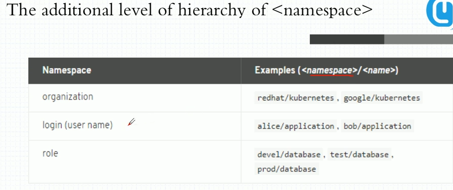

```
docker pull quay.io/coreos/flannel

等同于

docker pull quay.io/coreos/flannel:latest
```

## 镜像相关操作

### 镜像的生成途径


* Docker Hub automated builds本质还是基于Dockerfile

#### 基于容器制作镜像


举例子：busybox最小镜像二次制作

```
docker run --name b1 -it busybox /bin/sh
```
配置http服务
```
mkdir -p /data/html

cat << EOF > /data/html/index.html
<h1>Busybox httpd server.</h1>
EOF
```

当前修改了容器中的内容，如果删除容器，该内容不会保存。镜像的本质就是要保存自己需要的内容。

不能关闭容器，使用commit制作镜像

* 引入docker commit


* commit直接指明基于那个容器制作镜像
* commit可以不指定任何仓库和标签，其实相当于git仓库没有指定远端和分支。不指定其实就是本地裸镜像，不属于任何仓库，同理，git裸仓库
* **commit制作镜像不需要关闭容器，但如果容器中的程序一直在运行，那有些文件只有一半？**，可以暂停运行

* 制作镜像

```
docker commit -p b1
```


运行镜像查看文件是否存在

仓库和tag都为空，如何给镜像打标签？

* 给镜像打标签，引入tag命令


* 打标签必须引用源镜像，引用方式可以是 **仓库名:标签名** 也可以是，镜像ID，唯一表示一个镜像
* 如果没有指定**仓库名:标签名**，那就只能通过ID来引用
* 一个镜像可以拥有多个标签，但是镜像ID可以是一样的

```
docker tag 38baa mageedu/httpd:v0.1-1
```

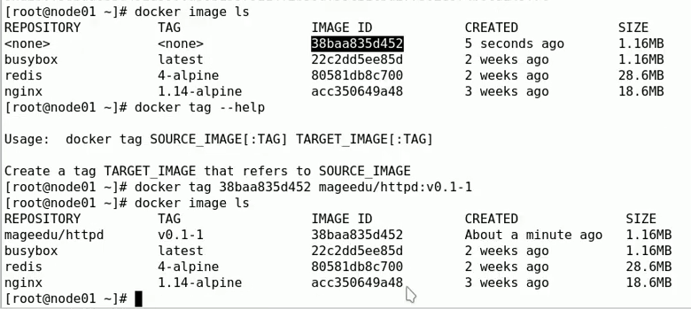

```
docker tag mageedu/httpd:v0.1-1 mageedu/httpd:latest
```

同一个镜像ID可以多个**仓库名:标签名**，相当于硬链接，删除一个镜像不会真实删除镜像，因为还有其他**仓库名:标签名**引用这个镜像ID，所以镜像ID才是唯一标识一个镜像


* 删除**仓库名:标签名**，相当于删除硬链接中的一个引用

```
docker image rm mageedu/httpd:v0.1-1
```

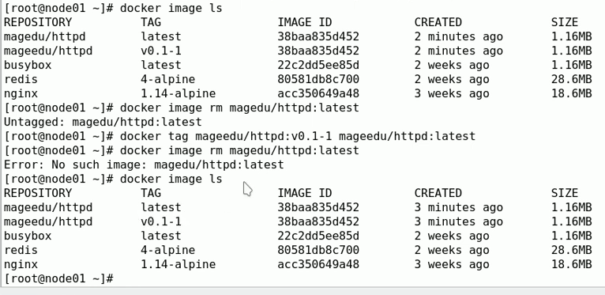

* 获取镜像配置信息-引入inspect命令

```
docker inspect busybox
```

* 镜像配置定义了启动此镜像时默认要运行的程序，当然也可以手动指定


* 制作镜像的同时添加标签指定默认要运行的程序


前台运行httpd服务

```
httpd -f -h /data/html/
```


* commit制作镜像同时修改dockerfile配置 -c选项
* -a，--author 指定作者
* -p，--pause 暂停

```
docker commit -a "MageEdu<mage@magedu.com>" \
              -c 'CMD ["/bin/httpd","-f","-h","/data/html"]' \
              -p b1        mageedu/httpd:v0.2
```


运行测试

* 不需要it交互式


* 没有任何信息，非交互式，因为不是终端，而是httpd前台进程


* 推送到docker hub

创建过程与github仓库创建流程一致，先创建仓库，然后本地推送，本地也是需要指定远端仓库地址

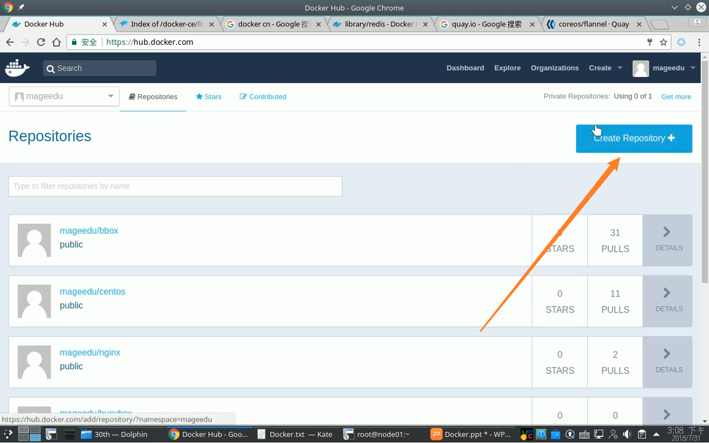

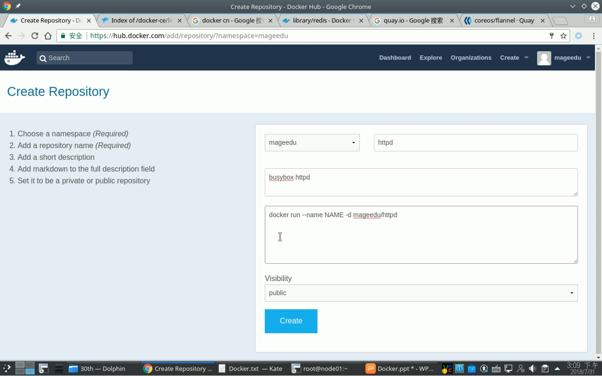


1. 可以指定仓库和标签，也可以省略标签，相当于推送仓库所有标签
2. 推送之前需要登录，权限足够，不然随便一个人随便推送到一个名称空间，起不很乱

```
docker push mageedu/httpd
```


```
docker login
```

1. 默认是docker hub，可以不指定镜像站点
2. 如果非docker hub，则必须指明server端


查看推送结果

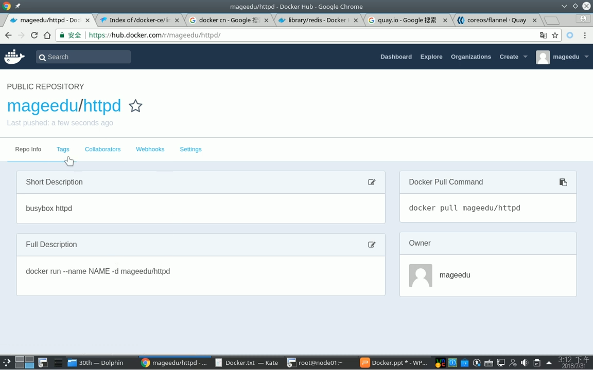

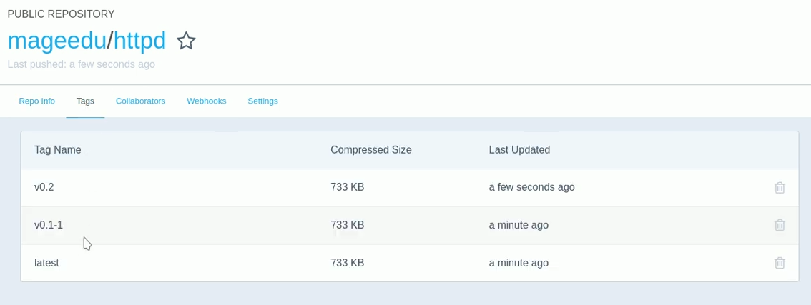

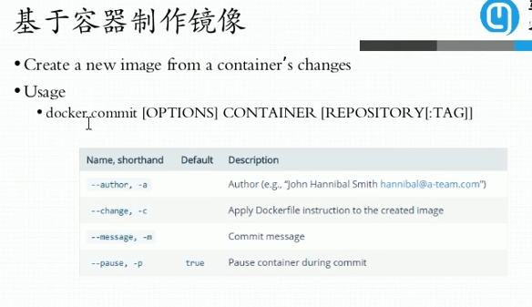

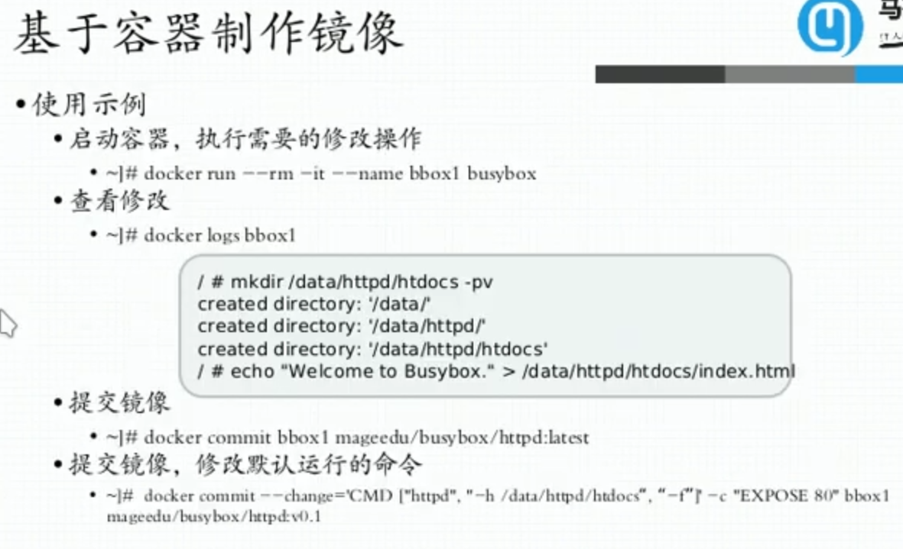

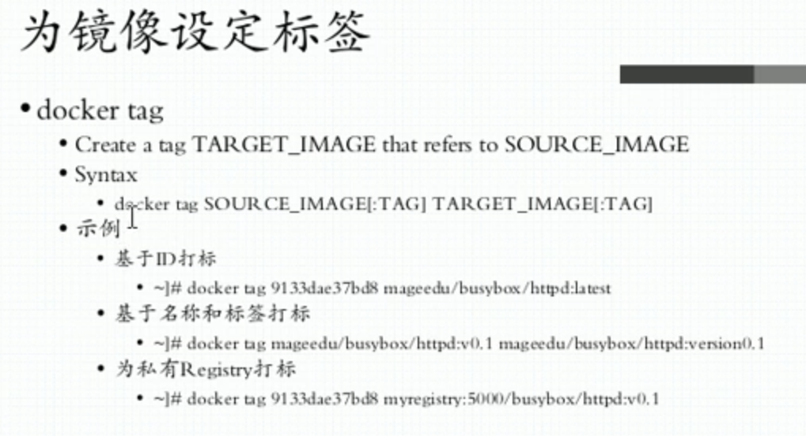

#### 推送镜像到阿里云


* 虽然马哥国内镜像站点推荐使用阿里云<https://dev.aliyun.com/>。。但是好像换地方了


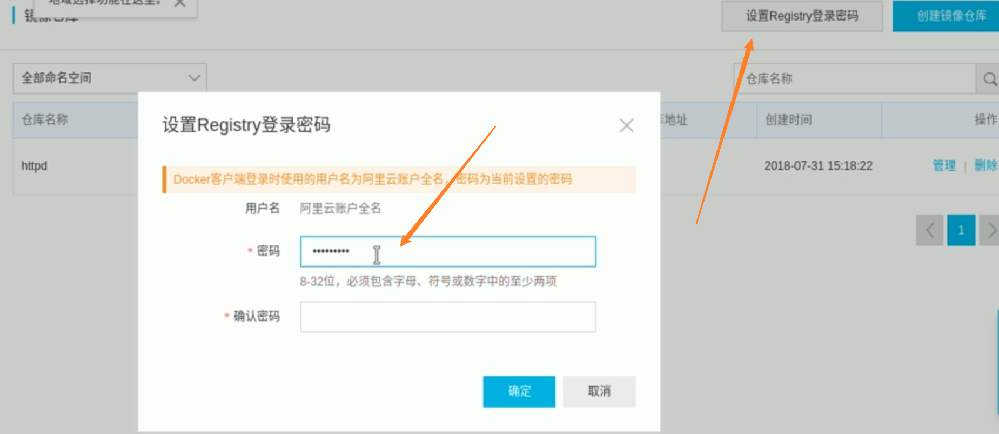


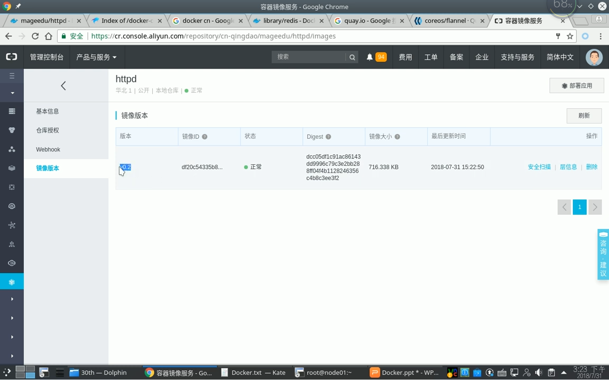

* 推送的**仓库名:标签名** 必须保持与阿里云配置一致才能正常推送
* 先配置阿里云的镜像仓库，然后本地配置，再推送

### 镜像的导入和导出

* 引入docker save命令


支持多镜像打包

```
docker save -o myimages.gz mageedu/http:v0.1-1 mageedu/httpd:v0.2
```


文件传输到其他机器加载即可使用


* 引入docker load命令


```
docker load -i myimages.gz
```


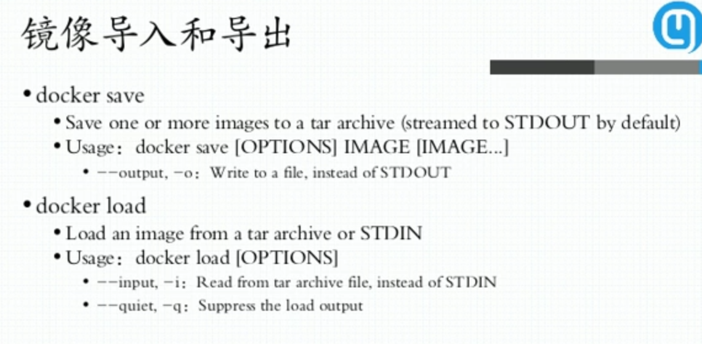 


---
